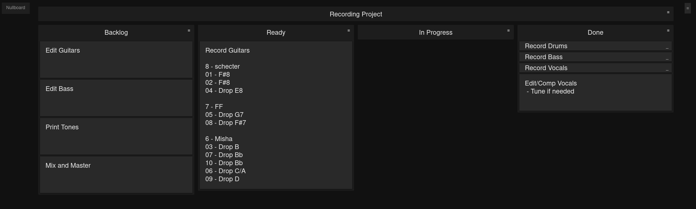

# Nullboard
Nullboard is a minimalist take on a kanban board / a task list manager, designed to be compact, readable and quick in use.

This is a fork of https://github.com/apankrat/nullboard.

## Example

## Changes
The major change is that the boards are now stored on the server, rather than the client.

While making this change I also removed the history/undo-redo functionality.

Keeping that functionality with the changes to the file storage would have been very complicated, and I didn't use it in the first place.

I also removed the options for changing font size and changing the theme.

This was purely a personal decision since I revamped most of the styling anyway, opting for a dark theme with larger text.

## Installation with Docker-Compose
To install with Docker-Compose:
 * Clone the Repository
 * Edit the docker-compose.yml file to change the network (if needed) and the published port
 * Create and run the container   `docker-compose up -d`

## Installation without Docker
To install on Debian:
 * Clone the Repository
 * Install Apache with PHP   `sudo apt-get install apache2 php libapache2-mod-php`
 * Copy the app folder into Apache's root directory   `sudo cp -r nullboard/app /var/www/html`
 * Change permissions on Apache's root directory so PHP can write   `sudo chown -R www-data:www-data /var/www/html`
